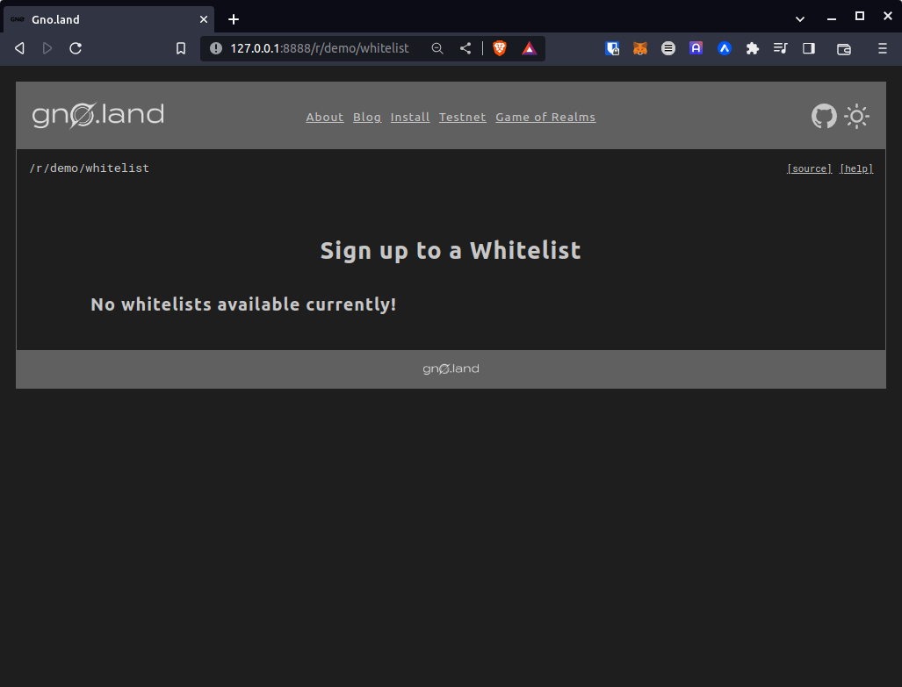
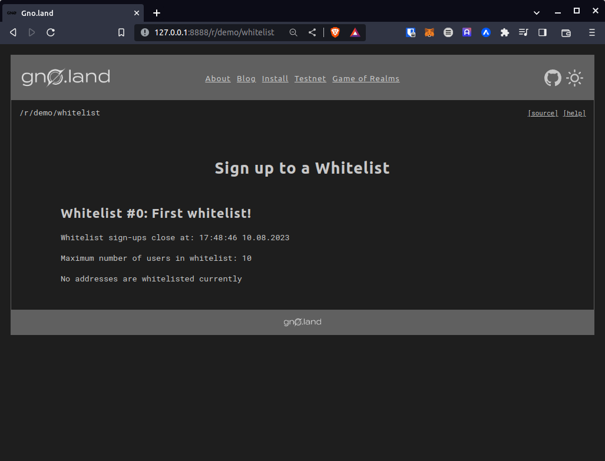
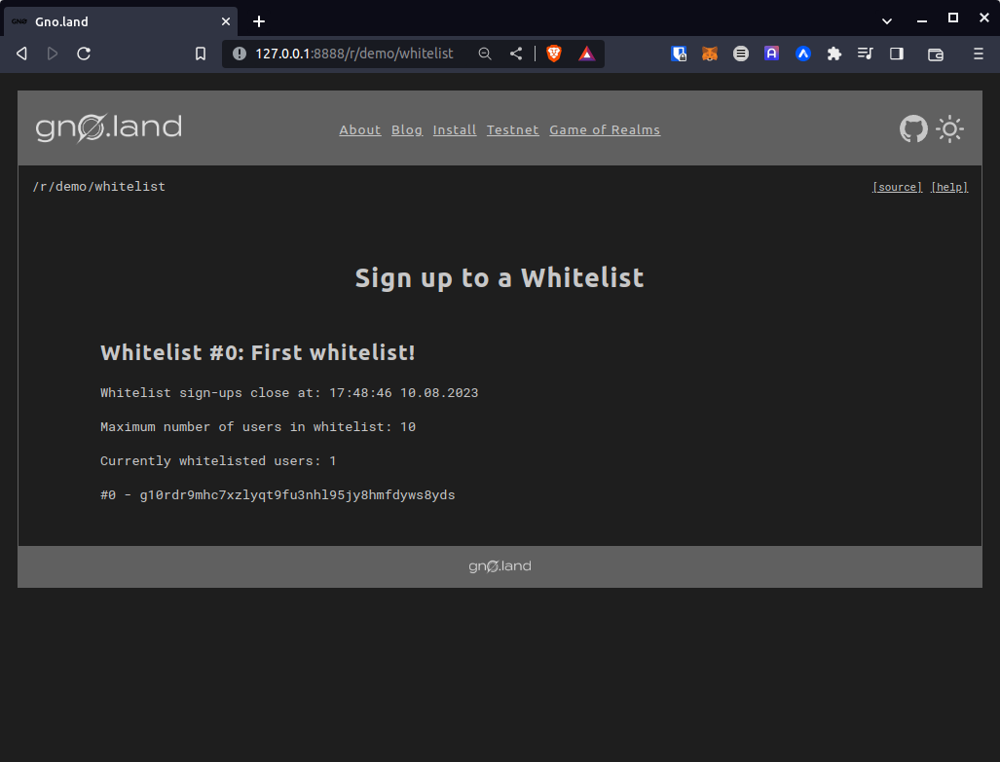
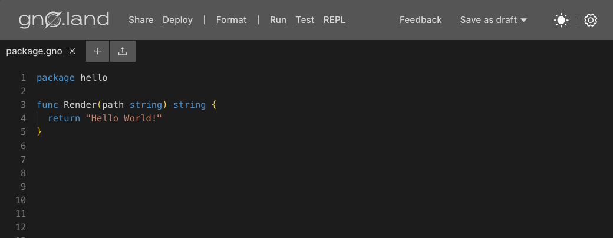
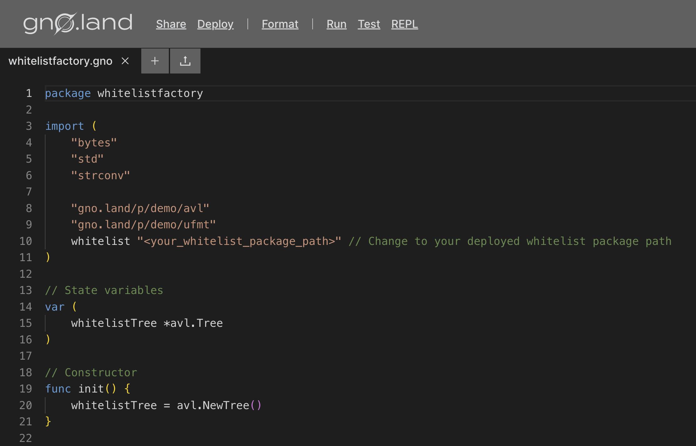

# From Zero to Gno.land Hero


In this tutorial, we will enter the world of **Gno.land**, and build our own
smart contract using the **Gno** programming language. Gno is an interpreted
version of Golang that shares 99% of the functionality with Go, allowing us
to write blockchain-specific code in a secure, battle-tested language that many
developers already have in their skillset.

We will go over what Gno.land is, and how you can use the full potential of Gno
to build secure blockchain applications in a familiar blockchain language.

## Why Gno.land?

Gno.land is a layer 1 blockchain network based on Tendermint2 technology.
It aims to offesecurity, scalability, and high-quality smart contract
libraries to developers while also being interconnected with existing Cosmos
chains via IBC1. Gno.land comes with GnoVM, a VM which allows us to
run interpreted Gno code. Currently, Gno.land has a development testnet out,
with the mainnet release expected in 2024. You can read more about
Gno.land [here](https://gno.land/).

## Tutorial overview

> _Note: Familiarity with Golang, although not a strict necessity,
is recommended to follow this tutorial._

This tutorial will review the tools and procedures required to develop in Gno.land. These are:

1. Environment setup
2. Generating a Gno.land keypair with `Gnokey`
3. Writing & testing a smart contract in `Gno`
4. Hands-on coding
5. Using `Gnoweb` to browse on-chain state
6. Deploying our code to a local testnet
7. Deploying code to a remote testnet using the Gno Playground

## Environment setup

Make sure you have set up your environment correctly:

- Go 1.19+
- Make (for using Makefiles)
- Git
- Make sure `$GOPATH` is well-defined, and `$GOPATH/bin` is added to your
  `$PATH` variable.

To get started with development, we need to clone the 
[Gno monorepo](https://github.com/gnolang/gno):

```bash
git clone git@github.com:gnolang/gno.git
```

Next, install all the necessary binaries:

1. `gno` - binary for running & testing the Gno language, found in `gnovm/`

```
cd gnovm
make build && make install
```

2. `gnoland` - binary containing the node which opens up an RPC API, found in
   `gno.land/`

```
cd gno.land
make build && make install
```

3. `gnodev` - a tool to help you develop Gno apps faster
```
make install.gnodev
```

> The `install.gnodev` command can be found in the root Makefile.

This completes the environment setup.

To follow this tutorial, having the Official Documentation handy is recommended. 
You can view the official documentation [here](https://docs.gno.land/).

## Generating a Gno.land keypair with Gnokey

To interact with the `Gno.land` blockchain, we must generate a keypair.
This is done using the
[`gnokey`](https://docs.gno.land/gno-tooling/cli/gno-tooling-gnokey) CLI tool.

In order to avoid having to use a faucet, we will generate a keypair which already
has a premined balance. To do this, run the following command: 

```
gnokey add Dev --recover
```

`gnokey` will ask you for a password to encrypt the keypair and save
it under the name `Dev`. After confirming the password, `gnokey` will ask 
you for a BIP39 mnemonic phrase. Input the following:
```
source bonus chronic canvas draft south burst lottery vacant surface solve popular case indicate oppose farm nothing bullet exhibit title speed wink action roast
```

This will generate a keypair which will be displayed after successful execution.

You can also see currently saved keypairs by running `gnokey list`.

Other than generating keypairs, `gnokey` is used to interact with the
Gno.land blockchain via the CLI. `gnokey` can fetch information about
an address, call functions on smart contracts and send state changes
(transactions) to the network. This will be covered later.

## Writing & testing in Gno

In Gno.land, smart contracts are called [Realms](https://docs.gno.land/concepts/realms). Here are three
Gno.land concepts we need to cover before diving into the actual
development of Realms:

1. Packages vs. Realms
2. Render functions
3. Paths

### Packages vs. Realms

Gno.land code can be divided into two main groups: packages & realms.
Put simply, packages represent stateless code intended to be reused -
libraries. Realms, on the other hand, represent smart contracts that
can hold arbitrary state and functionality. Both packages and realms
can be uploaded on-chain.

### Render functions

Each realm can implement a `Render` function which allows the developer
of the realm to display the state the way they intend to. A render function
should return a valid markdown string. Similar to Solidity, Gno
also has the concept of `view` functions, allowing the state of the realm to
be displayed in an arbitrary UI.

### Paths

Gno.land saves its packages and realms in a tree-like structure - similar
to a classic file system. You can find packages under the `"gno.land/p/"`
path, while you can find realms under the `"gno.land/r/"` path. 
When developing an app in Gno, you can access and import packages
through their deployed paths.

A developer must provide a path upon deployment of packages and realms. Developers
may choose a namespace to deploy their code under. Specifically, packages must be
deployed under `"gno.land/p/demo/<package_name>"`, while realms can be deployed
under `"gno.land/r/<your_username>/<realm_name>"`.

Let's get started with the code. We will build an app allowing users to sign
up for whitelists before a specific deadline.

## Hands-on coding

We will write a simple package and realm combination to act as a whitelisting
service.

Any user will be able to create their own whitelist with a specific sign up
deadline and max user sign-up number. Any user will be able to sign up exactly
once for each whitelist that has not exceeded the deadline or the max amount
of sign-ups.

If you're using VSCode to edit your files, you can install the
[Gno extension](https://marketplace.visualstudio.com/items?itemName=harry-hov.gno), which will handle syntax highlighting and code formatting.

### Whitelist package

To start, create a new separate folder which will store your Gno code. In this folder,
create two subfolders, `p/` and `r/`

```shell
mkdir p && mkdir r
```

In `p/`, initialize a `gno.mod` file, used to keep track of the package path and 
dependencies:

```shell
gno mod init gno.land/p/demo/whitelist
```

Now, you can create the file which will store your Gno code:

```shell
touch whitelist.gno
```

In `whitelist.gno`, we will place our `Whitelist` struct and all of its functionality:

```go
package whitelist

import (
	"std"
)

type Whitelist struct {
	name     string         // Name of whitelist
	owner    std.Address    // Owner of whitelist
	deadline int            // Whitelist deadline in block height
	maxUsers int            // Max number of users in whitelist
	userList []std.Address  // Currently signed-up users
}
```

We will use the [standard library](https://docs.gno.land/concepts/standard-library/overview)
provided by Gno to handle blockchain-specific data types and functionality.
In the code above, we are defining a struct that will hold all information we
need about a specific whitelist. We use `std.Address` as the address type
provided in Gno.

Next, we can write functions that we will need to act upon this struct:

```go
// Create a new Whitelist instance from arguments
func NewWhitelist(name string, deadline int, maxUsers int, owner std.Address) *Whitelist {
	return &Whitelist{
		name:     name,
		owner:    owner,
		deadline: deadline,
		maxUsers: maxUsers,
		userList: make([]std.Address, 0),
	}
}

func (w *Whitelist) GetWhitelistName() string {
	return w.name
}

func (w *Whitelist) GetWhitelistOwner() std.Address {
	return w.owner
}

func (w *Whitelist) GetWhitelistDeadline() int {
	return w.deadline
}

func (w *Whitelist) GetMaxUsers() int {
	return w.maxUsers
}

func (w *Whitelist) GetWhitelistedUsers() []std.Address {
	return w.userList
}

func (w *Whitelist) AddUserToList(userToAdd std.Address) bool {
	w.userList = append(w.userList, userToAdd)
	return true
}

// Check if userToCheck is on whitelist w
func (w *Whitelist) IsOnWhitelist(userToCheck std.Address) bool {
	for _, user := range w.GetWhitelistedUsers() {
		if user.String() == userToCheck.String() {
			return true
		}
	}
	return false
}

// Check if txSender is owner of w
func (w *Whitelist) IsOwnerOfWhitelist(txSender std.Address) bool {
	return txSender == w.GetWhitelistOwner()
}
```

### Testing the package

To test the package we just wrote, we can create a new file in the same
directory called `whitelist_test.gno`.

```
touch whitelist_test.gno
```

In `whitelist_test.gno`, we are able to do classic Go testing upon the
functionality of our package. Every function name that starts with
`Test` will automatically be run as a test case.

We use the `testutils` package to provide blockchain-specific test
functionality, such as setting an arbitrary caller to a transaction or
generating a new address from within the test. This package is actually
found on-chain - in the Gno.land's file system. The GnoVM resolves
the path to the `testutils` package and imports the needed tools from on-chain
storage. You will see this pattern further down this tutorial as well.

```go
package whitelist

import (
	"std"
	"testing"

	"gno.land/p/demo/testutils"
)

func TestWhitelist_Setup(t *testing.T) {
	var (
		name     = "First whitelist!"
		deadline = std.GetHeight() + 100 // get future height
		maxUsers = 100
	)

	// generate mock address
	alice := testutils.TestAddress("alice") 
	
	// use mock address to execute test transaction
	std.TestSetOrigCaller(alice)

	w := NewWhitelist(name, int(deadline), maxUsers, alice)

	if w.GetWhitelistOwner() != alice {
		t.Fatal("invalid whitelist owner")
	}

	if w.GetMaxUsers() != maxUsers {
		t.Fatal("invalid max user number")
	}

	if w.GetWhitelistDeadline() != deadline {
		t.Fatal("invalid deadline")
	}

	if len(w.GetWhitelistedUsers()) != 0 {
		t.Fatal("invalid whitelisted user list")
	}
}
```

To compile the package and run the tests, we can run the following
command from the same directory:

```
gno test . -v
```

Finally, to make sure all dependencies are correctly imported, run `gno mod tidy`.
This will add the `testutils` package as a dependency in `gno.mod`.

### WhitelistFactory Realm

This is where the bulk of our functionality will be. The main thing
differentiating packages from realms is that realms hold state and have
an initializer function. In our `r/` directory, just like before, initialize 
a `gno.mod` file with the following command:

```shell
gno mod init gno.land/r/<YOUR_USERNAME>/whitelistfactory
```

Then, create a new file, `whitelistfactory.gno`:

```
touch whitelistfactory.gno
```

In the file, we can start writing our realm. Since the realm will also
handle whitelist creation, we are calling it `whitelistfactory`:

```go
package whitelistfactory

import (
	"bytes"
	"std"
	"strconv"

	"gno.land/p/demo/avl"
	"gno.land/p/demo/ufmt"
	whitelist "<your_whitelist_package_path>" // *Import your whitelist package
)

// State variables
var (
	whitelistTree *avl.Tree
)

// Constructor
func init() {
	whitelistTree = avl.NewTree()
}
```
> *The import path for your whitelist is what you defined in the `gno.mod` file.

Here, we have two particular Gno-specific things: the AVL Tree and
the `init()` function.

Since all actions on the Gno.land blockchain must be deterministic,
we are unable to use the native Go `map` functionality to store our data.
This is why we are using custom-built [AVL trees](https://docs.gno.land/concepts/packages#avl), which expose a
classic `get/set` API to the developer.

We also have an `init()` function which will run upon deployment of
the realm. At deployment, we simply instantiate the AVL tree that will
store all of our Whitelist instances.

Moving on:

```go
func NewWhitelist(name string, deadline int, maxUsers int) string {
	// Check if deadline is in the past
	if deadline <= int(std.GetHeight()) {
		panic("deadline cannot be in the past")
	}

	// Get user who sent the transaction
	txSender := std.GetOrigCaller()

	// We will use the current size of the tree for the ID
	id := strconv.Itoa(whitelistTree.Size())

	if maxUsers <= 0 {
		panic("maximum number of users cannot be less than 1")
	}

	// Create new whitelist instance
	w := whitelist.NewWhitelist(name, deadline, maxUsers, txSender)

	// Update AVL tree with new state
	whitelistTree.Set(id, w)
	return id
}
```

The function above creates an instance of a whitelist with arguments
provided to it. This is a public function as indicated by the uppercase
first letter in its name - meaning anyone can call it.

Similar to Solidity's `msg.sender` functionality, we can use
`std.GetOrigCaller()` to get the address of the transaction sender.

Next, we need to write the function that users will use to
sign up to specific whitelists.

To sign up for a whitelist, four conditions must be met:

1. The whitelist with the specified ID must exist
2. The sign-up deadline must be in the future
3. The user cannot already be on the whitelist
4. The whitelist must have enough room for the user to sign up

If all conditions are met, we will update the whitelist instance
in the AVL tree to its new state.

```go
func SignUpToWhitelist(whitelistID int) string {
	// Get ID and convert to string
	id := strconv.Itoa(whitelistID)

	// Get txSender
	txSender := std.GetOrigCaller()

	// Try to get specific whitelist from AVL tree
	// Note: AVL tree keys are of the string type
	whiteListRaw, exists := whitelistTree.Get(id)

	if !exists {
		panic("whitelist does not exist")
	}

	// Cast raw Tree data into "Whitelist" type
	w, _ := whiteListRaw.(*whitelist.Whitelist)

	ddl := w.GetWhitelistDeadline()

	// error handling
	if w.IsOnWhitelist(txSender) {
		panic("user already in whitelist")
	}

	// If deadline has passed
	if ddl <= int(std.GetHeight()) {
		panic("whitelist already closed")
	}

	// If whitelist is full
	if w.GetMaxUsers() <= len(w.GetWhitelistedUsers()) {
		panic("whitelist full")
	}

	// Add txSender to user list
	w.AddUserToList(txSender)

	// Update the AVL tree with new state
	whitelistTree.Set(id, w)
	return "successfully signed up to " + id
}
```

Finally, we will write a `Render` function to display the state
of our realm. The Render function will display all whitelists that
currently exist in the state of the realm, along with their details.

```go
func Render(path string) string {
	if path == "" {
		return renderHomepage()
	}

	return "unknown page"
}
```

We need to handle possible additional arguments to our realm path, so we
will write a helper render function to handle the main logic.

We will generate valid markdown text based on the state of the realm into
a `Buffer`, which we will finally convert into a string that will be displayed later.

```go
func renderHomepage() string {
	// Define empty buffer
	var b bytes.Buffer

	b.WriteString("# Sign up to a Whitelist\n\n")

	// If no whitelists have been created
	if whitelistTree.Size() == 0 {
		b.WriteString("### No whitelists available currently!")
		return b.String()
	}

	// Iterate through AVL tree
	whitelistTree.Iterate("", "", func(key string, value interface{}) bool {

		// cast raw data from tree into Whitelist struct
		w := value.(*whitelist.Whitelist)
		ddl := w.GetWhitelistDeadline()

		// Add whitelist name
		b.WriteString(
			ufmt.Sprintf(
				"## Whitelist #%s: %s\n",
				key, // whitelist ID
				w.GetWhitelistName(),
			),
		)

		// Check if whitelist deadline is past due
		if ddl > int(std.GetHeight()) {
			b.WriteString(
				ufmt.Sprintf(
					"Whitelist sign-ups close at block %d\n\n",
					w.GetWhitelistDeadline(),
				),
			)
		} else {
			b.WriteString(
				ufmt.Sprintf(
					"Whitelist sign-ups closed!\n\n",
				),
			)
		}

		// List max number of users in waitlist
		b.WriteString(
			ufmt.Sprintf(
				"Maximum number of users in whitelist: %d\n\n",
				w.GetMaxUsers(),
			),
		)

		// List all users that are currently whitelisted
		if users := w.GetWhitelistedUsers(); len(users) > 0 {
			b.WriteString(
				ufmt.Sprintf("Currently whitelisted users: %d\n\n", len(users)),
			)

			for index, user := range users {
				b.WriteString(
					ufmt.Sprintf("#%d - %s  \n", index, user),
				)
			}
		} else {
			b.WriteString("No addresses are whitelisted currently\n")
		}

		b.WriteString("\n")
		return false
	})

	return b.String()
}
```

That completes our realm code, and we can go onto deploying it along with
the `whitelist` package from before.

## Using Gnoweb to view on-chain state

For this section of the tutorial, we will use the `gnoweb` CLI tool - 
it will allow us to access the aforementioned on-chain file
system. `gnoweb` will spin up a local front end where we will find all the
currently deployed packages and realms.

Before using `gnoweb`, we first need to spin up our local node. We will also
need this node to be running to see other tools in action, as well as deploy
Gno code to the local testnet. Start the node with `gnoland start`.

If the node has started successfully, you should see blocks being produced.

Then, run the `gnoweb` command from within the `gno.land` subfolder. A local
front end will start on `127.0.0.1:8888`.

### Check address balance

To deploy Gno code to the chain, we need testnet GNOTs. In a previous step,
we have generated a keypair that has a premined balance. Let's check the balance
of our address with the [gnokey query](https://docs.gno.land/gno-tooling/cli/gno-tooling-gnokey#make-an-abci-query) 
command: 
```
$ gnokey query bank/balances/g1jg8mtutu9khhfwc4nxmuhcpftf0pajdhfvsqf5

height: 0
data: "10000000000000ugnot"
```

## Deployment to a local testnet

First, we need to deploy our `whitelist` package. Make sure that the local
node is running, and navigate to the the root of the repo, and run the
following command:

```
gnokey maketx addpkg \
--pkgpath "<whitelist_path_from_gno.mod>" \
--pkgdir "./p" \
--gas-fee 10000000ugnot \
--gas-wanted 800000 \
--broadcast \
--chainid dev \
--remote localhost:26657 \
Dev
```

As mentioned earlier, `gnokey` is used to interact with Gno.land. Let's analyze
the subcommands and flags in detail:

1. `maketx` - signs and broadcasts a transaction
2. `addpkg` - indicates that the transaction will upload a new package or realm
3. `--pkgpath` - path where the package/realm will be placed on-chain
4. `--pkgdir` - local path where the package/realm is located
5. `--gas-wanted` - the upper limit for units of gas for the execution of the
   transaction - similar to Solidity's `gas limit`
6. `--gas-fee` - similar to Solidity's `gas-price`
7. `--broadcast` - broadcast the transaction on-chain
8. `--chain-id` - id of the chain to connect to, in our case the local node, `dev`
9. `--remote` - specify node endpoint, in our case it's our local node
10. `Dev` - the keypair to use for the transaction

After running the command, if successful, we should get the following output:

```
OK!
GAS WANTED: 800000
GAS USED:   775097
```

Now our package can be seen on-chain. We can take a look at the code with
`gnoweb`, by visiting the path we uploaded it to:
`127.0.0.1:8888/p/<username>/whitelist`.

With the whitelist package deployed, you can properly import it into your realm
and continue with deployment:

```
gnokey maketx addpkg \
--pkgpath "<whitelistfactory_path_from_gno.mod>" \
--pkgdir "./r" \
--gas-fee 10000000ugnot \
--gas-wanted 800000 \
--broadcast \
--chainid dev \
--remote localhost:26657 \
Dev
```

Congrats!

If all went well, you've just written and uploaded your first Gno.land
package and realm. You can visit the realm path to see the `Render`
function in action: `127.0.0.1:8888/r/<YOUR_USERNAME>/whitelistfactory`. 
It should look something like this:



Finally, let's interact with our realm. Again, we are using `gnokey`,
but this time around, instead of `addpkg`, we will use the `call` subcommand,
which will call a specific public function on a realm:

```
gnokey maketx call \
--pkgpath "gno.land/r/demo/whitelist" \
--func "NewWhitelist" \
--args "First whitelist!" \
--args 500 \
--args 10 \
--gas-fee 10000000ugnot \
--gas-wanted 800000 \
--broadcast  \
--remote localhost:26657 \
Dev
```

The above command calls the NewWhitelist function in our realm, passing it
the `name,` `deadline,` and `maxUser` arguments. Make sure to use a deadline
that is in the future. You can use a tool like [UnixTimestamp](https://www.unixtimestamp.com/) to get a
Unix seconds representation of a specific date and time.

If the command was successful, we can see the state update on the realm
through `gnoweb`.



Finally, we can try to sign up to the whitelist:

```
gnokey maketx call \
--pkgpath "gno.land/r/demo/whitelist" \
--func "SignUpToWhitelist" \
--args 0 \
--gas-fee 10000000ugnot \
--gas-wanted 800000 \
--broadcast  \
--remote localhost:26657 \
Dev
```

We call the `SignUpToWhitelist` with the `whitelistID` argument being `0`.
After the transaction goes through, we can see the state update:



Finally, if you'd wish to restart and wipe the node data, shut the gnoland
node down, and run the following from within the `gno.land` folder:

```
make fclean && make build && make install
```

Then, to start the node again, run:

```
gnoland start
```

## Deploying to a remote testnet

In this section, you will learn how to deploy the whitelist package and realm
to the Gno.land test3 testnet through Gno.land's online editor, Gno Playground.

To follow along, you will need to install a Gno.land web browser wallet, such as
[Adena](https://www.adena.app/), and create a keypair. This will allow you to
interact with the Playground.

Next, visit the [Playground](https://play.gno.land). You will be greeted with a
simple `package.gno` file.



First we should test and deploy the `whitelist` package. To do this, delete `package.gno`,
and create files like before: `whitelist.gno` & `whitelist_test.gno`. Then,
paste in the respective code, or just visit [this link](https://play.gno.land/p/yR0zHTvk0_6)
with the pre-written code.

Gno Playground allows you to test, deploy, and share code in your browser.
Clicking on "Test" will open a terminal and after a few seconds you should see
the following output:


After we've verified our code works, we are ready to deploy the package code to
the Portal loop testnet. Clicking on the "Deploy" button will prompt a wallet connection, and then
you will see the following:


Change the deployment path as you see fit - for example,`gno.land/p/<your_name>/whitelist`.
Keep in mind that this is the path you will use to later import the package 
and use it for the `WhitelistFactory` realm.

Choose `Portal Loop` for the network and click `Deploy`.

Gno Playground has a built-in faucet, which means that even if you do not have any
testnet GNOTs, the deployment should result in a success.

After successfully deploying the package, we can continue with the realm code.

Delete the old files, and create a new one - `whitelistfactory.gno`.
Paste in the code, or simply find it on [this link](https://play.gno.land/p/Qz9_5M03XRd).



After you've confirmed the code, you can choose a path to deploy your realm to.
When the realm has been deployed to the Portal loop testnet, you will be able
to look it up simply by inputting the realm path in your browser. 

This concludes our tutorial. Once again, congratulations on writing
your first realm in Gno. You've become a real Gno.land hero!

> Written _August 10th 2023_, last updated _March 30th 2024_